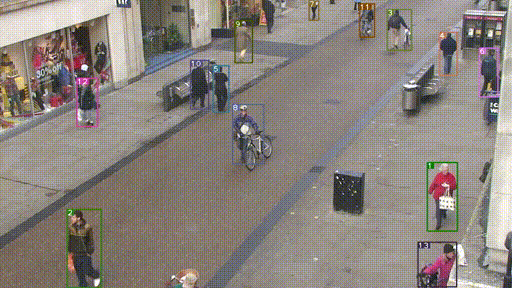

# Yolov3 + Deep Sort with PyTorch



## Introduction

This repository contains a moded version of PyTorch YOLOv3 (https://github.com/ultralytics/yolov3). It filters out every detection that is not a person. The detections of persons are then passed to a Deep Sort algorithm (https://github.com/ZQPei/deep_sort_pytorch) which tracks the persons. The reason behind the fact that it just tracks persons is that the deep association metric is trained on a person ONLY datatset.

## Description

The implementation is based on two papers:

- Simple Online and Realtime Tracking with a Deep Association Metric
https://arxiv.org/abs/1703.07402
- YOLOv3: An Incremental Improvement
https://arxiv.org/abs/1804.02767

## Requirements

Python 3.7 or later with all of the `pip install -U -r requirements.txt` packages including:
- `torch >= 1.3`
- `opencv-python`
- `Pillow`

All dependencies are included in the associated docker images. Docker requirements are: 
- `nvidia-docker`
- Nvidia Driver Version >= 440.44

## Before you run the tracker

Github block pushes of files larger than 100 MB (https://help.github.com/en/github/managing-large-files/conditions-for-large-files). Hence the yolo weights needs to be stored somewhere else. When you run tracker.py you will get an exceptions telling you that the yolov3 weight are missing and a link to download them from. Place the downlaoded `.pt` file under `yolov3/weights/`. The weights for deep sort are already in this repo. They can be found under `deep_sort/deep/checkpoint/`.

## Tracking

`track.py` runs tracking on any video source:

```bash
python3 track.py --source ...
```

- Video:  `--source file.mp4`
- Webcam:  `--source 0`
- RTSP stream:  `--source rtsp://170.93.143.139/rtplive/470011e600ef003a004ee33696235daa`
- HTTP stream:  `--source http://wmccpinetop.axiscam.net/mjpg/video.mjpg`

The video used for the .gif can be downloaded by:

```bash
wget http://www.robots.ox.ac.uk/ActiveVision/Research/Projects/2009bbenfold_headpose/Datasets/TownCentreXVID.avi
```

## Other information

For more detailed information about the algorithms used in this project access their official github implementations.

